# Práctica 2: Aplicación móvil para operaciones CRUD con un servicio REST

**Nombre completo:** Diego Raymundo Hernández Alonso
**Número de boleta:** 2022361124
**Grupo:** 7CV4
**Asignatura:** Desarrollo de aplicaciones móviles nativas
**Profesor:** Gabriel Hurtado Avilés
**Fecha de entrega:** 18 de septiembre de 2026

---

## Aviso sobre el repositorio de ejemplo

Este proyecto **parte del repositorio de ejemplo** proporcionado por el profesor
([gabrielhuav/Flask-Compose-Login-API](https://github.com/gabrielhuav/Flask-Compose-Login-API)),
del cual se hizo un *fork*.

### Archivos modificados

| Archivo | Cambio realizado |
|---|---|
| `Docker-Flask/ORM/app.py` | Se agregó el modelo `Tarea`, el decorador `token_required`, la generación de tokens firmados en `/login` y los cuatro endpoints CRUD de tareas. |
| `Android/FlaskLogin/app/build.gradle.kts` | Se agregaron las dependencias de Retrofit, OkHttp, Navigation Compose, ViewModel y Material Icons. |
| `Android/FlaskLogin/app/src/main/AndroidManifest.xml` | Se agregó el permiso de INTERNET y el atributo `usesCleartextTraffic`. |
| `Android/FlaskLogin/.../MainActivity.kt` | Se reescribió por completo: navegación entre tres pantallas, login, registro y lista de tareas con CRUD. |

### Archivos agregados

| Archivo | Descripción |
|---|---|
| `Docker-Flask/ORM/.gitignore` | Excluye la base de datos, el caché de Python y los archivos `.env`. |
| `Android/FlaskLogin/.../Modelos.kt` | Clases de datos para las peticiones y respuestas de la API. |
| `Android/FlaskLogin/.../ApiService.kt` | Interfaz de Retrofit que declara los seis endpoints. |
| `Android/FlaskLogin/.../RetrofitClient.kt` | Cliente HTTP configurado con la URL base y el interceptor de logs. |
| `Android/FlaskLogin/.../TareasViewModel.kt` | Lógica de negocio y manejo de estado de la aplicación. |
| `docs/` | Capturas de pantalla de la ejecución. |

---

## 1. Introducción

Esta práctica consiste en un sistema completo de gestión de tareas dividido en dos
componentes que se comunican mediante peticiones HTTP:

- Un **backend REST** escrito en Python con Flask, empaquetado en un contenedor de
  Docker, que expone los endpoints de autenticación y las operaciones CRUD sobre
  el recurso *tarea*, y persiste la información en una base de datos SQLite.
- Una **aplicación Android nativa** escrita en Kotlin con Jetpack Compose, que
  consume esos endpoints mediante Retrofit y presenta la información en una
  interfaz con Material 3.

### Lógica general

El flujo de la aplicación es el siguiente. El usuario se registra o inicia sesión desde
la aplicación móvil; el backend verifica sus credenciales contra el hash almacenado y,
si son correctas, devuelve un **token firmado con tiempo de expiración**. La aplicación
guarda ese token en memoria y lo envía en la cabecera `Authorization` de todas las
peticiones siguientes. Cada endpoint de tareas está protegido por un decorador que
valida el token antes de ejecutar cualquier operación, y todas las consultas a la base
de datos se filtran por el identificador de usuario extraído del token, de manera que
ningún usuario puede leer ni modificar las tareas de otro.

### Stack elegido y justificación

| Componente | Tecnología | Justificación |
|---|---|---|
| Backend | **Flask** (Python) | Framework minimalista; el ejemplo base del curso ya lo utilizaba y permite exponer una API REST con muy poco código repetitivo. |
| ORM | **Flask-SQLAlchemy** | Permite definir las tablas como clases de Python y evita escribir SQL manualmente, reduciendo errores de sintaxis y de escapado. |
| Base de datos | **SQLite** | No requiere un servicio externo ni un contenedor adicional: toda la información vive en un archivo local, lo que simplifica el levantamiento del entorno. |
| Hasheo | **Flask-Bcrypt** | Implementa bcrypt, que aplica una sal aleatoria por contraseña y es resistente a ataques por fuerza bruta. |
| Tokens | **itsdangerous** | Ya viene incluida con Flask, por lo que no agrega dependencias nuevas. Genera tokens firmados criptográficamente con marca de tiempo, lo que permite verificar integridad y expiración. |
| Contenedores | **Docker Compose** | Describe todo el entorno en un solo archivo y permite levantarlo con un único comando en cualquier equipo. |
| App móvil | **Kotlin + Jetpack Compose** | Lenguaje y kit de interfaz oficiales de Android. Compose usa un modelo declarativo en el que la interfaz se redibuja automáticamente cuando cambia el estado. |
| Cliente HTTP | **Retrofit + OkHttp** | Permite declarar los endpoints como funciones de Kotlin con anotaciones y convierte el JSON a objetos automáticamente mediante Gson. |

---

## 2. Desarrollo

### 2.1 Conceptos fundamentales

#### Docker

Docker es una plataforma que empaqueta una aplicación junto con todo lo que necesita
para ejecutarse —el intérprete del lenguaje, las librerías, las dependencias y la
configuración— dentro de una unidad aislada llamada contenedor. A diferencia de una
máquina virtual, que emula un sistema operativo completo, el contenedor comparte el
núcleo del sistema anfitrión, por lo que arranca en segundos y consume mucha menos
memoria.

Su ventaja principal es la **reproducibilidad**. En esta práctica, gracias a Docker no
fue necesario instalar Python, Flask ni SQLAlchemy en el equipo de desarrollo: todo eso
está descrito en el `Dockerfile` y Docker lo construye por sí solo. El proyecto se
ejecuta igual en cualquier computadora que tenga Docker instalado.

#### Imagen y contenedor

La **imagen** es una plantilla inmutable: una fotografía del sistema de archivos con
todo ya instalado. El **contenedor** es una instancia en ejecución de esa imagen. La
relación entre ambos es análoga a la que existe entre una clase y un objeto en
programación orientada a objetos: de una sola imagen pueden crearse varios contenedores
idénticos, igual que de una clase pueden instanciarse varios objetos.

El contenedor es **efímero**: al eliminarlo se pierde todo lo que se haya escrito dentro
de él. Por eso la información que debe conservarse —en este caso, la base de datos— se
guarda en un **volumen**, que vive fuera del contenedor y sobrevive a su destrucción.

#### Dockerfile

Es un archivo de texto con las instrucciones que Docker ejecuta paso a paso para
construir la imagen. El de este proyecto es el siguiente:

```dockerfile
FROM python:3.9-slim
WORKDIR /app
COPY requirements.txt .
RUN pip install --no-cache-dir -r requirements.txt
COPY . .
EXPOSE 5000
CMD ["python", "app.py"]
```

Instrucción por instrucción:

- **`FROM python:3.9-slim`** — define la imagen base. En lugar de partir de un sistema
  vacío, se parte de una imagen que ya trae Python 3.9 instalado. La variante `slim`
  es una versión reducida que ocupa menos espacio.
- **`WORKDIR /app`** — crea el directorio `/app` dentro del contenedor y se posiciona
  en él. Equivale a un `cd`; todas las instrucciones posteriores se ejecutan ahí.
- **`COPY requirements.txt .`** — copia únicamente el archivo con la lista de
  dependencias desde el equipo anfitrión al contenedor.
- **`RUN pip install --no-cache-dir -r requirements.txt`** — instala las librerías
  listadas. La bandera `--no-cache-dir` evita guardar los archivos descargados, lo que
  reduce el tamaño final de la imagen.
- **`COPY . .`** — copia el resto del código fuente.
- **`EXPOSE 5000`** — documenta que la aplicación escucha en el puerto 5000. Es
  importante señalar que esta instrucción **no publica el puerto por sí sola**: sirve
  como documentación para quien lea el archivo. La publicación real se hace desde
  `docker-compose.yml`.
- **`CMD ["python", "app.py"]`** — define el comando que se ejecuta cada vez que nace
  un contenedor a partir de la imagen.

Sobre el orden de las instrucciones: Docker guarda una capa en caché después de cada
línea, y al reconstruir reutiliza las capas cuyo contenido no cambió. Por eso se copia
`requirements.txt` e se instalan las dependencias **antes** de copiar el resto del
código: como el código fuente cambia constantemente durante el desarrollo y las
dependencias casi nunca, este orden evita reinstalar las librerías en cada
reconstrucción.

#### docker-compose.yml

Es un archivo en formato YAML que describe la aplicación como un conjunto de servicios,
con sus puertos, volúmenes, redes y variables de entorno, de modo que todo el entorno se
levante o se detenga con un solo comando.

```yaml
services:
  web:
    build: .
    container_name: flask_login_backend
    ports:
      - "5000:5000"
    volumes:
      - .:/app
```

- **`build: .`** — indica que la imagen no se descarga de un registro público, sino que
  se construye a partir del `Dockerfile` ubicado en el directorio actual.
- **`container_name`** — asigna un nombre legible al contenedor, lo que facilita
  referirse a él en comandos como `docker exec`.
- **`ports: "5000:5000"`** — publica el puerto. Se lee de izquierda a derecha como
  *puerto del equipo anfitrión : puerto del contenedor*. Este mapeo es el que
  efectivamente permite que una petición dirigida a `localhost:5000` desde Windows
  alcance a Flask dentro del contenedor.
- **`volumes: .:/app`** — monta el directorio actual del anfitrión sobre `/app` dentro
  del contenedor. No es una copia, sino un enlace en tiempo real: al modificar `app.py`
  desde el editor, el cambio es visible de inmediato dentro del contenedor y Flask se
  recarga automáticamente gracias al modo *debug*. Este volumen es además el mecanismo
  que permite que el archivo `site.db` persista fuera del contenedor.

#### Backend o servicio REST

Es un programa que se ejecuta del lado del servidor y expone la lógica de negocio
mediante rutas accesibles por HTTP. Recibe peticiones con los verbos GET, POST, PUT y
DELETE, valida la información recibida, consulta o modifica la base de datos y responde
en formato JSON acompañado del código de estado HTTP correspondiente.

En este proyecto se sigue la convención REST estándar: la ruta nombra el recurso
(`/tareas`) y el verbo HTTP indica la acción, en lugar de codificar la acción dentro de
la ruta.

#### ORM y base de datos

Un ORM (*Object-Relational Mapping*) permite manipular las tablas de la base de datos
como objetos del lenguaje de programación, sin escribir SQL directamente. En este
proyecto se emplea SQLAlchemy. La correspondencia es prácticamente literal:

| Definición en SQLAlchemy | Equivalente en SQL |
|---|---|
| `class Tarea(db.Model)` | `CREATE TABLE tarea` |
| `db.Column(db.Integer, primary_key=True)` | `INTEGER PRIMARY KEY` |
| `db.Column(db.String(100), nullable=False)` | `VARCHAR(100) NOT NULL` |
| `db.Column(db.Boolean, default=False)` | `BOOLEAN DEFAULT 0` |
| `db.ForeignKey('user.id')` | `FOREIGN KEY REFERENCES user(id)` |

El motor de base de datos utilizado es **SQLite**, que almacena toda la información en
un único archivo local (`instance/site.db`) y no requiere un servicio independiente.

---

### 2.2 Modelo de datos

El recurso elegido para las operaciones CRUD es la **tarea**. La base de datos está
compuesta por dos tablas relacionadas mediante una llave foránea.

**Tabla `user`**

| Campo | Tipo | Restricciones |
|---|---|---|
| `id` | INTEGER | Llave primaria |
| `username` | VARCHAR(20) | Único, no nulo |
| `password` | VARCHAR(60) | No nulo (almacena el hash bcrypt) |

**Tabla `tarea`**

| Campo | Tipo | Restricciones |
|---|---|---|
| `id` | INTEGER | Llave primaria |
| `titulo` | VARCHAR(100) | No nulo |
| `descripcion` | VARCHAR(300) | Opcional |
| `prioridad` | VARCHAR(10) | No nulo (`alta`, `media` o `baja`) |
| `completada` | BOOLEAN | No nulo, por omisión `false` |
| `user_id` | INTEGER | No nulo, llave foránea a `user.id` |

---

### 2.3 Documentación de los endpoints

La URL base durante el desarrollo es `http://localhost:5000` desde el equipo anfitrión
y `http://10.0.2.2:5000` desde el emulador de Android.

Los endpoints marcados como **protegidos** requieren la cabecera
`Authorization: Bearer <token>`. Si el token falta, está mal formado, fue alterado o
expiró, la respuesta es `401 Unauthorized`.

---

#### `GET /`

Verifica que la API esté activa. No requiere autenticación.

**Respuesta `200`**
```json
{ "message": "API Funcionando" }
```

---

#### `POST /register`

Registra un nuevo usuario. La contraseña se almacena hasheada con bcrypt.

**Parámetros (cuerpo JSON)**

| Campo | Tipo | Obligatorio |
|---|---|---|
| `username` | string | Sí |
| `password` | string | Sí |

**Petición**
```json
{ "username": "diego", "password": "prueba123" }
```

**Respuesta `201`**
```json
{ "message": "Usuario creado exitosamente" }
```

**Respuesta `400`** — usuario duplicado o campos faltantes
```json
{ "message": "El usuario ya existe" }
```

---

#### `POST /login`

Autentica un usuario existente y devuelve un token de sesión con una hora de vigencia.

**Petición**
```json
{ "username": "diego", "password": "prueba123" }
```

**Respuesta `200`**
```json
{
  "status": "success",
  "message": "Login exitoso",
  "token": "eyJ1c2VyX2lkIjoxfQ.aq3-4A.D4TBRUKC4aMKjm99wSiuF6rBaic",
  "user_id": 1,
  "username": "diego"
}
```

**Respuesta `401`**
```json
{ "status": "error", "message": "Credenciales invalidas" }
```

---

#### `POST /tareas` — protegido

Crea una tarea. El campo `user_id` **no se recibe del cliente**: se extrae del token,
de manera que ningún usuario puede crear tareas a nombre de otro.

**Parámetros (cuerpo JSON)**

| Campo | Tipo | Obligatorio | Valor por omisión |
|---|---|---|---|
| `titulo` | string | Sí | — |
| `descripcion` | string | No | `null` |
| `prioridad` | string | No | `"media"` |

**Petición**
```json
{
  "titulo": "Estudiar Docker",
  "descripcion": "Repasar compose",
  "prioridad": "alta"
}
```

**Respuesta `201`**
```json
{
  "id": 1,
  "titulo": "Estudiar Docker",
  "descripcion": "Repasar compose",
  "prioridad": "alta",
  "completada": false,
  "user_id": 1
}
```

**Respuesta `400`** — falta el título
```json
{ "message": "El titulo es obligatorio" }
```

---

#### `GET /tareas` — protegido

Devuelve únicamente las tareas del usuario dueño del token.

**Respuesta `200`**
```json
[
  {
    "id": 1,
    "titulo": "Estudiar Docker",
    "descripcion": "Repasar compose",
    "prioridad": "alta",
    "completada": true,
    "user_id": 1
  }
]
```

---

#### `PUT /tareas/<id>` — protegido

Actualiza una tarea existente. Solo es necesario enviar los campos que se desean
modificar; los demás conservan su valor anterior.

**Petición**
```json
{ "completada": true }
```

**Respuesta `200`**
```json
{
  "id": 1,
  "titulo": "Estudiar Docker",
  "descripcion": "Repasar compose",
  "prioridad": "alta",
  "completada": true,
  "user_id": 1
}
```

**Respuesta `404`** — la tarea no existe o pertenece a otro usuario
```json
{ "message": "Tarea no encontrada" }
```

---

#### `DELETE /tareas/<id>` — protegido

Elimina una tarea del usuario autenticado.

**Respuesta `200`**
```json
{ "message": "Tarea eliminada" }
```

**Respuesta `404`**
```json
{ "message": "Tarea no encontrada" }
```

---

### 2.4 Seguridad

#### Hasheo de contraseñas

Las contraseñas nunca se almacenan en texto plano. Al registrarse, la contraseña pasa
por `bcrypt.generate_password_hash()`, que genera una sal aleatoria distinta para cada
usuario y produce un hash de 60 caracteres. Al iniciar sesión no se descifra nada: se
vuelve a hashear la contraseña recibida con la misma sal y se comparan los resultados
mediante `bcrypt.check_password_hash()`.

#### Sesiones mediante token firmado

El token se genera con `URLSafeTimedSerializer` de la librería `itsdangerous` y consta
de tres partes separadas por puntos: la carga útil (el identificador del usuario), una
marca de tiempo y una firma criptográfica derivada de la llave secreta del servidor.

Esto proporciona dos garantías:

- **Integridad.** Si un atacante modifica la carga útil para suplantar a otro usuario,
  la firma deja de coincidir y el servidor rechaza el token con `401`.
- **Expiración.** El parámetro `max_age=3600` provoca que el token deje de ser válido
  una hora después de su emisión, lo que limita la ventana de aprovechamiento en caso
  de robo de sesión.

La validación se realiza mediante el decorador `token_required`, que se antepone a cada
ruta protegida:

```python
def token_required(f):
    @wraps(f)
    def decorated(*args, **kwargs):
        auth = request.headers.get('Authorization', '')
        if not auth.startswith('Bearer '):
            return jsonify({"message": "Token faltante"}), 401
        token = auth.split(' ', 1)[1]
        try:
            data = serializer.loads(token, max_age=TOKEN_MAX_AGE)
        except SignatureExpired:
            return jsonify({"message": "Token expirado"}), 401
        except BadSignature:
            return jsonify({"message": "Token invalido"}), 401
        user = User.query.filter_by(id=data.get('user_id')).first()
        if not user:
            return jsonify({"message": "Usuario no encontrado"}), 401
        return f(user, *args, **kwargs)
    return decorated
```

#### Aislamiento entre usuarios

Todas las consultas de tareas incluyen el filtro `user_id=usuario_actual.id`. Si un
usuario solicita mediante `PUT` o `DELETE` una tarea que pertenece a otro, la consulta
no devuelve ningún resultado y el servidor responde `404`, sin revelar siquiera que el
registro existe.

#### Manejo de secretos

La llave con la que se firman los tokens se lee de la variable de entorno `SECRET_KEY`.
El archivo `.env` está excluido mediante `.gitignore`, de modo que ninguna credencial
queda escrita en el repositorio.

```python
app.config['SECRET_KEY'] = os.environ.get('SECRET_KEY', 'llave-de-desarrollo')
```

Para producción debe definirse la variable de entorno; el valor por omisión existe
únicamente para facilitar la ejecución en desarrollo.

---

### 2.5 Instalación y ejecución

#### Requisitos previos

- Docker Desktop instalado y con el motor en ejecución
- Android Studio con un emulador configurado (API 24 o superior)

#### Levantar el backend

```bash
git clone https://github.com/DiegoRHA030427/HernandezAlonsoPrac2.git
cd HernandezAlonsoPrac2/Docker-Flask/ORM
docker compose up --build
```

El servicio queda disponible en `http://localhost:5000`. La base de datos se crea
automáticamente al iniciar; no requiere ningún paso de migración.

Para verificar que responde:

```bash
curl http://localhost:5000/
```

#### Ejecutar la aplicación móvil

1. Abrir la carpeta `Android/FlaskLogin` desde Android Studio.
2. Esperar a que Gradle sincronice las dependencias.
3. Ejecutar la aplicación sobre un emulador con el botón **Run**.

#### Configuración de la URL base

La URL base está definida en `RetrofitClient.kt`:

```kotlin
private const val BASE_URL = "http://10.0.2.2:5000/"
```

La dirección `10.0.2.2` es la que el emulador de Android utiliza para alcanzar el
`localhost` del equipo anfitrión. Desde dentro del emulador, `localhost` se refiere al
propio dispositivo virtual, no a la computadora, por lo que utilizar esa dirección
provocaría un error de conexión.

Si se desea probar sobre un **dispositivo físico** conectado a la misma red, debe
sustituirse por la dirección IP local del equipo, por ejemplo
`http://192.168.1.75:5000/`.

Adicionalmente, dado que durante el desarrollo la API se consume por HTTP sin TLS, fue
necesario declarar en el `AndroidManifest.xml`:

```xml
<uses-permission android:name="android.permission.INTERNET" />
```

y dentro de la etiqueta `<application>`:

```xml
android:usesCleartextTraffic="true"
```

---

### 2.6 Evidencias de ejecución

#### Backend

**Levantamiento del entorno con `docker compose up --build`**

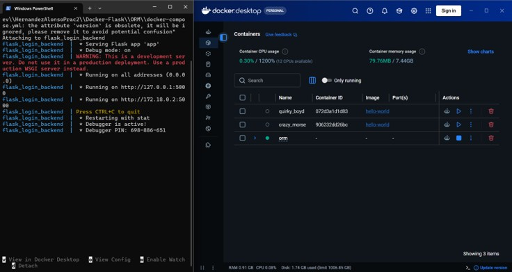

**Verificación del endpoint raíz**

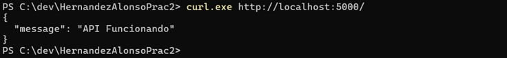

**Inicio de sesión con emisión de token**

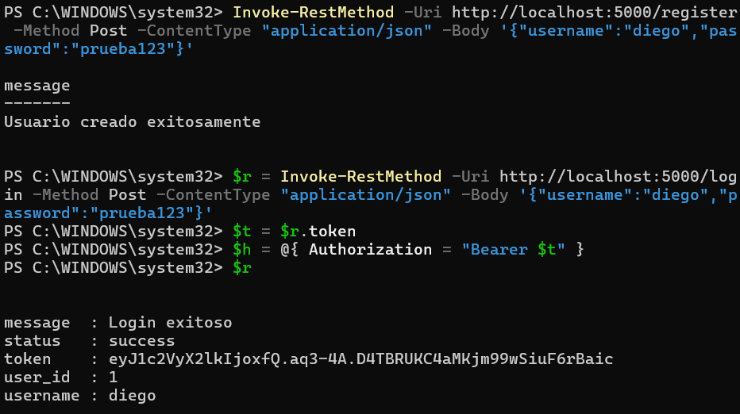

#### Operaciones CRUD

**CREATE — `POST /tareas`**

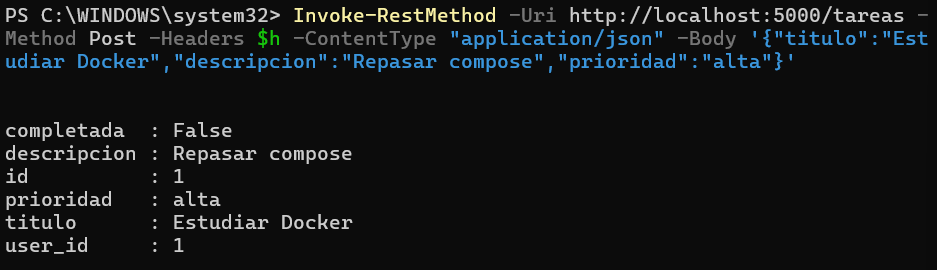

**READ — `GET /tareas`**

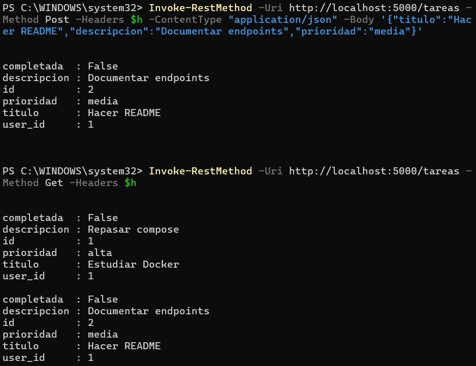

**UPDATE — `PUT /tareas/1`**

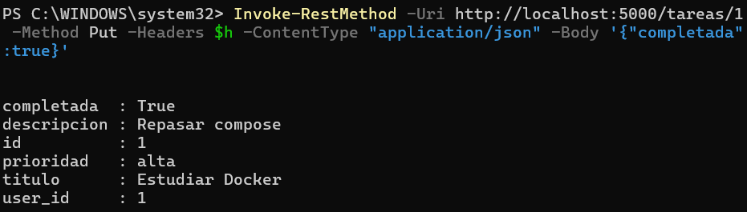

**DELETE — `DELETE /tareas/2`**

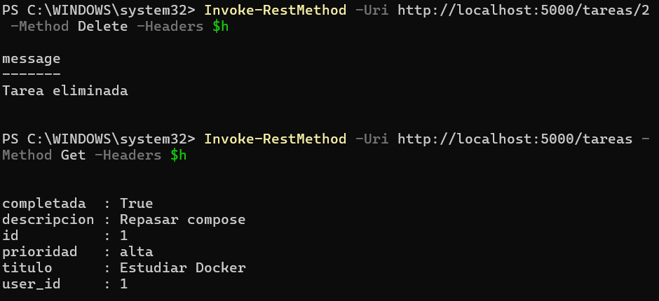

#### Pruebas de seguridad

**Acceso sin token y con token inválido**

Ambas peticiones son rechazadas con código `401`, lo que confirma que los endpoints
están efectivamente protegidos.

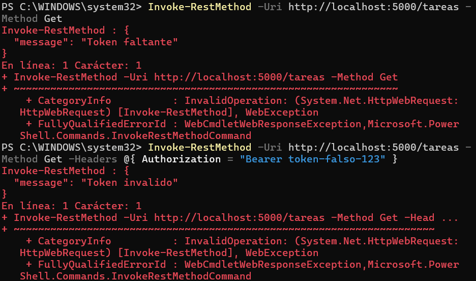

#### Aplicación móvil

**Pantalla de inicio de sesión**

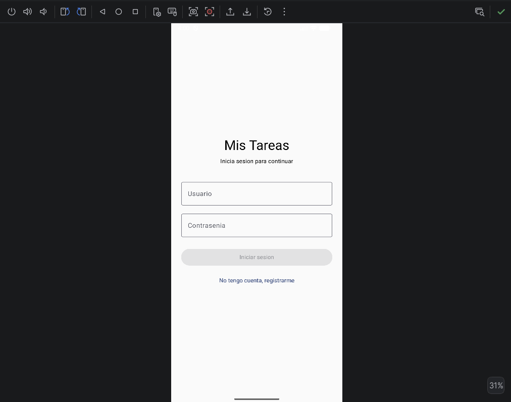

**Pantalla de registro de usuario**

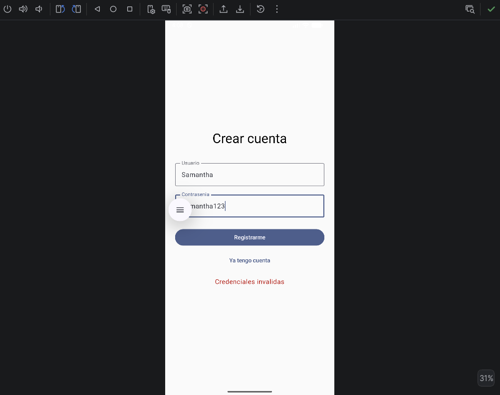

**Inicio de sesión con credenciales válidas**

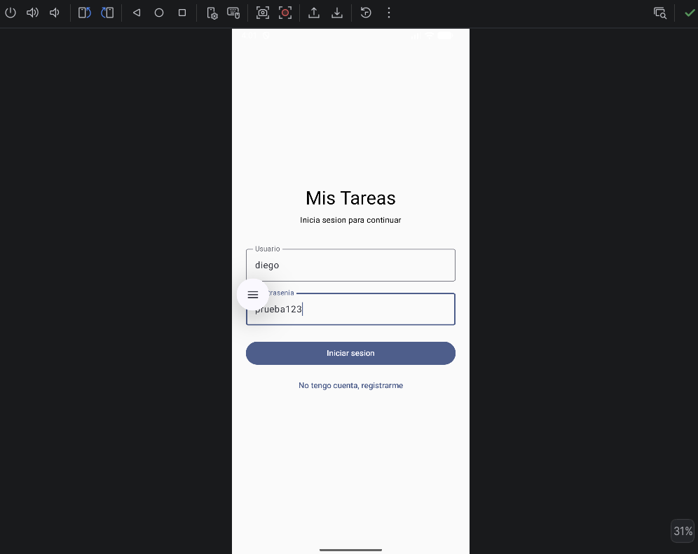

**Lista de tareas del usuario autenticado**

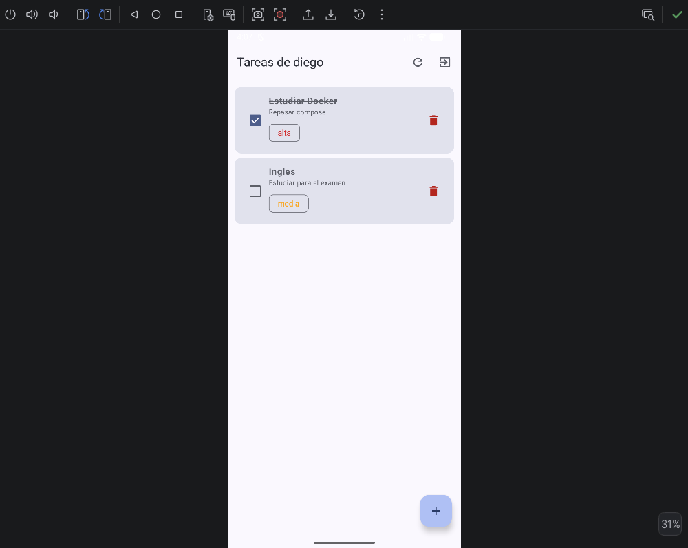

**Creación de una tarea desde la aplicación**

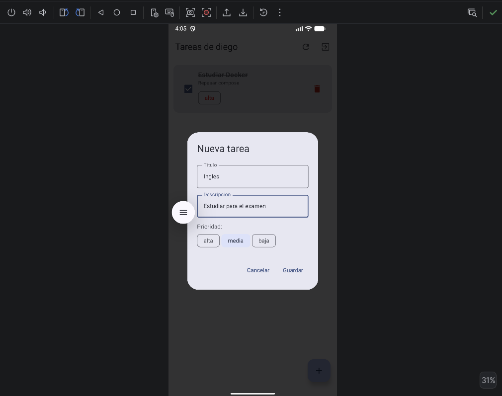

**Manejo de credenciales incorrectas**

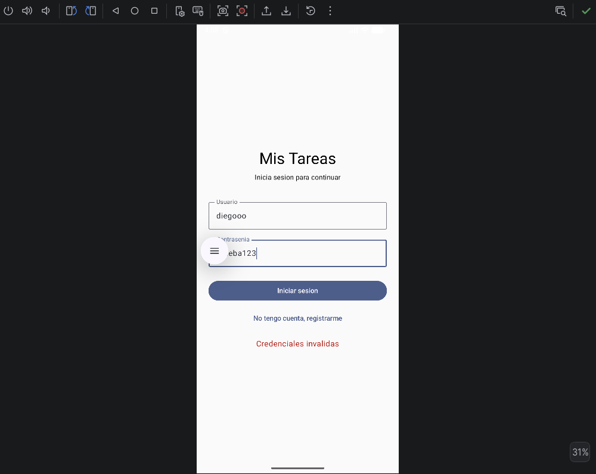

---

## 3. Conclusiones

### Retos y logros

El reto conceptual más importante fue entender que un contenedor está aislado del
sistema anfitrión. Al principio resultaba confuso que Flask reportara estar escuchando
en `localhost:5000` y que, sin embargo, ese `localhost` no fuera el de la computadora
sino el del propio contenedor. Comprender la diferencia entre `EXPOSE`, que únicamente
documenta el puerto, y el mapeo `ports` del `docker-compose.yml`, que es el que
realmente lo publica, fue lo que permitió que la conexión funcionara.

El segundo reto fue el manejo de direcciones desde el emulador. La misma API tiene tres
direcciones distintas según desde dónde se le mire: `127.0.0.1` dentro del contenedor,
`localhost` desde el equipo anfitrión y `10.0.2.2` desde el emulador de Android.
Utilizar la dirección equivocada produce un error de conexión sin explicación aparente.

El logro principal fue completar el circuito entero, desde una interfaz declarativa en
Jetpack Compose hasta una tabla de SQLite, pasando por Retrofit, el mapeo de puertos de
Docker y el ORM de SQLAlchemy, con una capa de autenticación funcional en medio.

### Dificultades encontradas y su solución

| Dificultad | Solución |
|---|---|
| Se clonó por error un repositorio distinto al indicado. | Se verificó el contenido con `dir` antes de continuar. Desde entonces se adoptó la práctica de comprobar siempre la estructura de archivos después de clonar. |
| El archivo `site.db` venía incluido en el repositorio de ejemplo, con usuarios previos. | Se eliminó del control de versiones con `git rm --cached` y se agregó un `.gitignore` para evitar que volviera a subirse. |
| PowerShell alteraba las comillas de los comandos `curl`, lo que provocaba respuestas `415`. | Se sustituyó `curl` por `Invoke-RestMethod`, que maneja correctamente el escapado de comillas en Windows. |
| Los cambios en `app.py` no surtían efecto porque el archivo no se había guardado en el editor. | Se verificó el contenido real en disco con `Select-String` antes de asumir que un cambio estaba aplicado. |
| Gradle no sincronizaba por incompatibilidad entre la versión 8.13 y el JDK 25. | Se configuró el proyecto para utilizar Amazon Corretto 21 desde *Build Tools → Gradle → Gradle JDK*. |
| El ejemplo base no entregaba ningún token al iniciar sesión. | Se implementó la emisión de tokens firmados con `itsdangerous` y el decorador `token_required` para proteger los endpoints. |

### Trabajo futuro

El token se conserva actualmente en memoria, por lo que la sesión se pierde al cerrar
la aplicación. Una mejora natural sería almacenarlo de forma cifrada mediante
`EncryptedSharedPreferences`. Asimismo, en un despliegue real el servicio debería
exponerse sobre HTTPS y ejecutarse detrás de un servidor WSGI de producción como
Gunicorn, en lugar del servidor de desarrollo de Flask.

---

## 4. Bibliografía

Android Developers. (2024). *Guía para desarrolladores de Android*. Google.
Recuperado de https://developer.android.com/guide

Android Developers. (2024). *Jetpack Compose: documentación oficial*. Google.
Recuperado de https://developer.android.com/develop/ui/compose/documentation

Docker Inc. (2024). *Docker Compose documentation*.
Recuperado de https://docs.docker.com/compose/

Docker Inc. (2024). *Dockerfile reference*.
Recuperado de https://docs.docker.com/reference/dockerfile/

Grinberg, M. (2018). *Flask web development: Developing web applications with Python*
(2.ª ed.). O'Reilly Media. ISBN: 9781491991732.

Griffiths, D., & Griffiths, D. (2017). *Head First Android Development: A
brain-friendly guide* (2.ª ed.). O'Reilly Media. ISBN: 9781491974056.

Pallets Projects. (2024). *Flask documentation*.
Recuperado de https://flask.palletsprojects.com/

Pallets Projects. (2024). *itsdangerous documentation*.
Recuperado de https://itsdangerous.palletsprojects.com/

Provos, N., & Mazières, D. (1999). A future-adaptable password scheme. *Proceedings of
the 1999 USENIX Annual Technical Conference*, 81–91.

SQLAlchemy. (2024). *SQLAlchemy ORM documentation*.
Recuperado de https://docs.sqlalchemy.org/en/20/orm/

Square Inc. (2024). *Retrofit: A type-safe HTTP client for Android and Java*.
Recuperado de https://square.github.io/retrofit/
